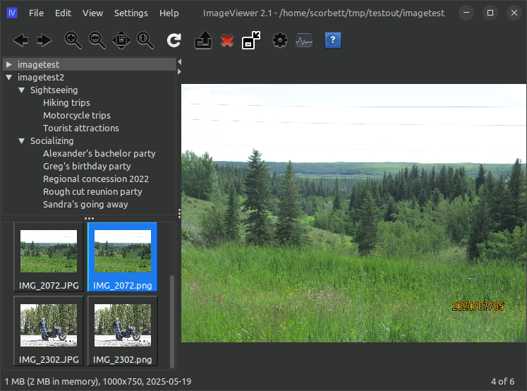

# imageviewer

This is "imageviewer", a 100% Java music player with a UI written in Java Swing.



Features:
- extremely customizable via Java extension classes
- highly configurable UI with LookAndFeel support
- quickly sort, rename, move, or symlink images
- very programmer-friendly if you want to write your own extensions

## How do I get it?

The easiest way is to clone the repo, build it with Maven, and run the jar file:

```shell
git clone https://github.com/scorbo2/imageviewer.git
cd imageviewer
mvn package
cd target
java -jar imageviewer-2.2.jar
```

If you have [install-scripts](https://github.com/scorbo2/install-scripts) installed, you can also
just run the `make-installer` command from the project root. This will (on linux) generate a tarball
containing an installer script and will provide a launcher script for more easily launching the application.

## User guide

Out of the box, ImageViewer is useful for browsing and viewing images. The real power of ImageViewer comes
from the application extension mechanism, which allows additional functionality to be added.

### Built-in extensions

Out of the box, ImageViewer comes with the following extensions:

- **ImageInformation** - provides a popup with information about the image file.
- **Repeat and undo** - allows you to repeat the previous image move/copy/symlink option, or undo it.
- **Statistics tracker** - tracks statistics on image operations and reports on them.
- **Thumbnail caching** - caches thumbnails automatically to speed up access to frequently-visited directories.

### Additional available extensions

- [Companion text file](https://github.com/scorbo2/ext-iv-companion-text-file) - allows you to have a text file alongside an image, and will handle moving/copying/symlinking it as needed.
- [Convert image](https://github.com/scorbo2/ext-iv-image-converter) - convert an image or a directory of images from png to jpeg or vice versa.
- [Full screen](https://github.com/scorbo2/ext-iv-fullscreen) - allows you to view images full screen with keyboard navigation. Great for slideshows.
- [Quick access](https://github.com/scorbo2/ext-iv-quick-access) - provides a "quick access" panel for very easy sorting of images to various destination directories.
- [Resize image](https://github.com/scorbo2/ext-iv-image-resize) - resize a single image or a directory of images using configurable resize triggers.
- [Transform image](https://github.com/scorbo2/ext-iv-image-transform) - rotate, mirror, or flip images easily.
- **Crop image** - easily crop images using a rectangular selection.
- **Add border** - easily add a configurable border to a single images or a directory of images.
- **Add watermark** - easily add a watermark with configurable position and transparency to an image or a directory of images.

### Create your own extension!

Because ImageViewer full source is available and is reasonably well documented, you can create your own extension
to do whatever image operation you'd like. A great starting point for this would be to pick any of the extensions above
(the source for which is also freely available) and use it as a template to see what kind of things are possible
to do in an extension.

## License

imageviewer is made available under the MIT license: https://opensource.org/license/mit

## Revision history

Originally written in 2017.  

[Full release notes](src/main/resources/ca/corbett/imageviewer/ReleaseNotes.txt)
