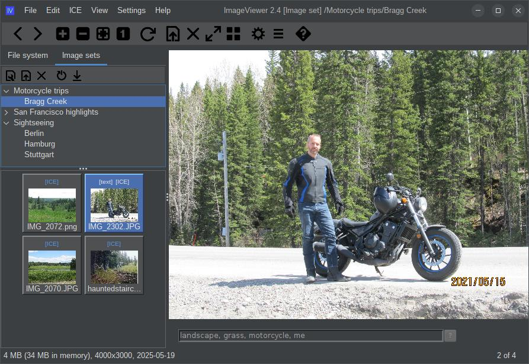
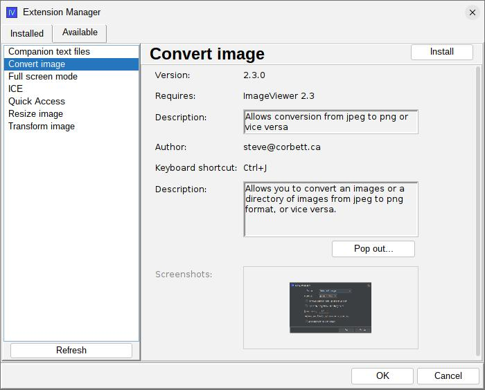

# ImageViewer

This is "ImageViewer", a 100% Java image viewer with a UI written in Java Swing.



Features:
- extremely customizable via Java extension classes
- highly configurable UI with LookAndFeel support
- quickly sort, rename, move, or symlink images
- very programmer-friendly if you want to write your own extensions

## How do I get it?

An installer tarball is available for linux-based systems. Just download, extract, and run
the installer script to install the application:

- [http://www.corbett.ca/apps/ImageViewer-3.0.tar.gz](http://www.corbett.ca/apps/ImageViewer-3.0.tar.gz)
- Size: 20MB
- SHA-256: `3e2f02c1578220f2fccd5f841201f7907d4f26805de3b42c9c9fcb5a30836496`

Alternatively, you can clone this repo and build it with Maven (Java 17 or higher required):

```shell
git clone https://github.com/scorbo2/imageviewer.git
cd imageviewer
mvn package

# Run manually:
cd target
java -jar imageviewer-3.0.jar
```

If you have [install-scripts](https://github.com/scorbo2/install-scripts) installed and you are running the build
on a Linux system, the installer tarball will be generated for you automatically during the build
and placed in the target directory. 

Using the installer tarball is preferable to running manually from the command line, as you get
a launcher script that sets environment variables properly, and you get a desktop icon for easy access.

## User guide

Out of the box, ImageViewer is useful for browsing and viewing images. The real power of ImageViewer comes
from the application extension mechanism, which allows additional functionality to be added.
Visit the extension manager dialog and switch to the "Available" tab to see a list of extensions that are
available for download:



### Built-in extensions

Out of the box, ImageViewer comes with the following built-in extensions:

- **Image information** - provides a popup with information about the image file.
- **Repeat and undo** - allows you to repeat the previous image move/copy/symlink option, or undo it.
- **Statistics tracker** - tracks statistics on image operations and reports on them.
- **Thumbnail caching** - caches thumbnails automatically to speed up access to frequently-visited directories.

### Additional available extensions

- [Companion text file](https://github.com/scorbo2/ext-iv-companion-text-file) - allows you to have a text file alongside an image, and will handle moving/copying/symlinking it as needed.
- [Convert image](https://github.com/scorbo2/ext-iv-image-converter) - convert an image or a directory of images from png to jpeg or vice versa.
- [Full screen](https://github.com/scorbo2/ext-iv-fullscreen) - allows you to view images full screen with keyboard navigation. Great for slideshows.
- [Quick access](https://github.com/scorbo2/ext-iv-quick-access) - provides a "quick access" panel for very easy sorting of images to various destination directories.
- [Resize image](https://github.com/scorbo2/ext-iv-image-resize) - resize a single image or a directory of images using configurable resize triggers.
- [Transform image](https://github.com/scorbo2/ext-iv-image-transform) - rotate, mirror, or flip images easily.
- **Crop image** - easily crop images using a rectangular selection.
- **Add border** - easily add a configurable border to a single images or a directory of images.
- **Add watermark** - easily add a watermark with configurable position and transparency to an image or a directory of images.
- [ICE](https://github.com/scorbo2/ext-iv-ice) - tag images semantically and search for images by tag

### Create your own extension!

Because ImageViewer full source is available and is reasonably well documented, you can create your own extension
to do whatever image operation you'd like. A great starting point for this would be to pick any of the extensions above
(the source for which is also freely available) and use it as a template to see what kind of things are possible
to do in an extension. Or, take a look at the [ImageViewerExtension class](https://github.com/scorbo2/imageviewer/blob/master/src/main/java/ca/corbett/imageviewer/extensions/ImageViewerExtension.java)
and its associated Javadocs, to see the extension points that your extension can hook into.

## License

ImageViewer is made available under the MIT license: https://opensource.org/license/mit

## Revision history

[Full release notes and version history](src/main/resources/ca/corbett/imageviewer/ReleaseNotes.txt)
